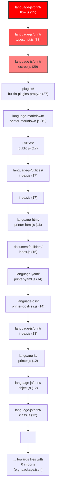

# Legend of `svg/dep-graph.svg` (prettier 3.8.2)

[DEPENDENCY GRAPH LINK](../svg/dep-graph.svg)

- **PURPLE** **NODES**: Represent files that have dependencies. These are the files that **import other modules**.

- **GREEN** **NODES**: Represent **"leaf"** files. These are modules that **do NOT import anything** else; they are **INDEPENDENT**

- **RED** **NODES**: These indicate a **WARNING**. They represent **circular dependencies** (e.g., File A imports File B, which in turn imports File A). These are the ones we should investigate to **improve our code architecture**.

- **YELLOW/ORANGE** **NODES**: Depending on settings, these can represent **orphaned files** or modules that are **NOT imported by any other file** in the analyzed set.

