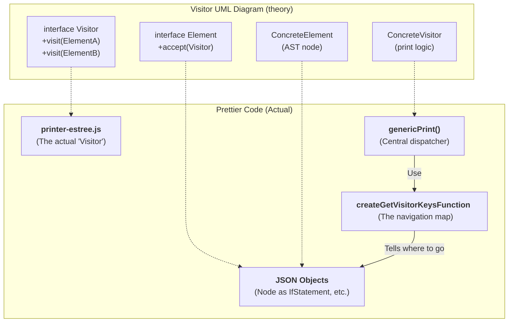
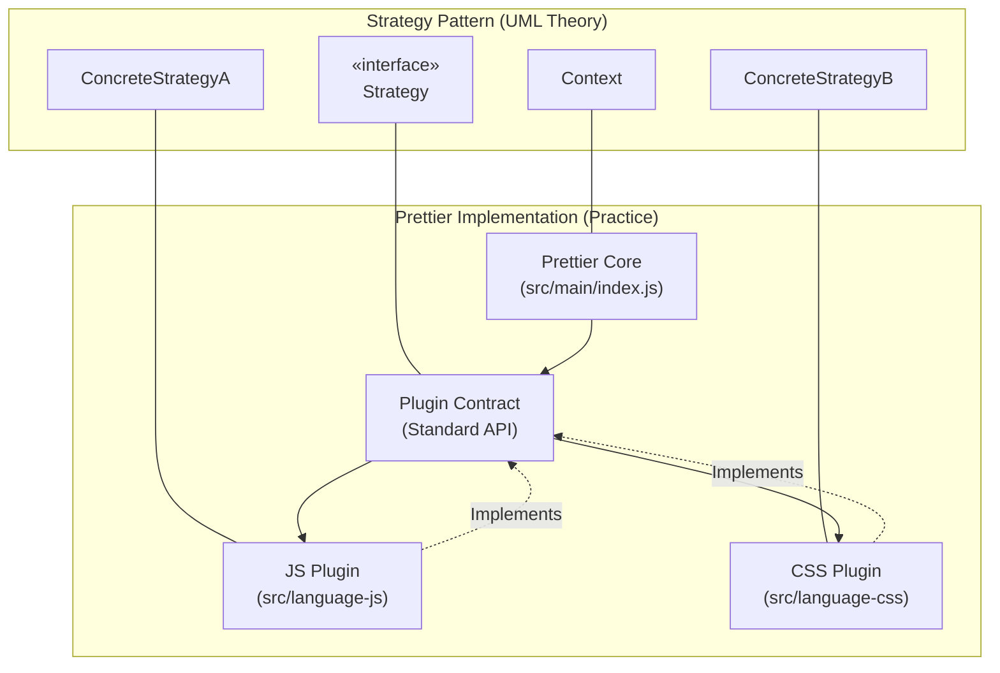
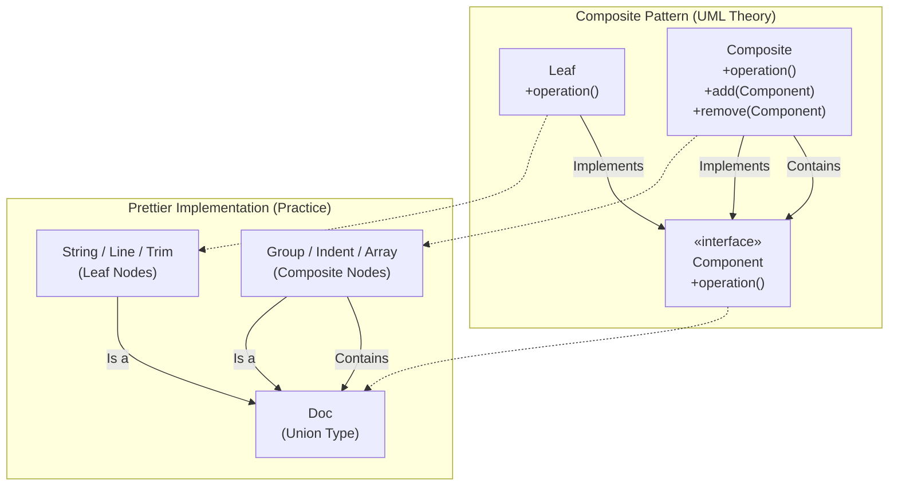

# Visitor Design Pattern (how to navigate AST)

## Less formal answers
- Which classes play which role? 
    - There are no classes involved but files. They are listed below in the diagram.
- Why is the pattern used? Which problem does solve?
	- This pattern is used to maintain outside the printing logic of every node of the AST tree without editing them. In this way it's possible to change the logic of the print. It allows to avoid the integration of the new feature into an existing node.
- Is there an alternative, what would be pros & cons?
	- The alternative could be to put the print logic inside a node of the AST but usually these structures are generated by external tool which uses default formats and it's better do avoid modifying them. It'd be a good choice in case of a little local developed node witi few attributes in order to use (`node.print()` or something like that). 

---

## 1. Which classes play which role?

This patterns is implemented in a functional way instead of rigid classes. The roles are:

- **The Visitor:** It's the **Printer** (es. `src/language-js/printer-estree.js`). His main function is `genericPrint`, which acts as the central dispatcher ("brain") who knows how to format every node type.
    
- **The Elements:** They're **the nodes of the AST** (Abstract Syntax Tree) generated by parsers. These objects represents the structure of the code (es. `IfStatement`, `BinaryExpression`).
    

- **The Navigator**: The `createGetVisitorKeysFunction` function (in `src/main/create-get-visitor-keys-function.js`) acts as the guide that instructs the Visitor on which node properties contain children to be visited, excluding non-traversable keys such as `parent` or `comments`.    

---

## 2. Why is the pattern used? Which problem does it solve?

Prettier uses the Visitor pattern to address the **Separation of Concerns** principle:

- **Decoupling:** It separates the printing algorithm from the AST data structure. This allows developers to change how a language is formatted without having to modify the parser that generates the tree.
    
- **Extensibility:** It makes it easier to add new languages. To support a language like Java, for example, you simply need to create a new Printer (a new Visitor) that knows how to navigate the nodes of the Java AST.
    
- **Complexity Management:** It manages the recursive nature of code. Since code is essentially a tree of trees (e.g., an `if` statement contains a `block`, which in turn contains a `variable`), the Visitor pattern is the most natural way to process deep hierarchical structures without writing monolithic code.
    

---

## 3. Is there an alternative, what would be pros & cons?

The main alternative would be to embed the printing logic directly inside the AST nodes (a procedural or classic object-oriented approach).

### Alternative: "Print" methods inside nodes

- **Pros:**
    
    - **More intuitive for small projects:** Each object knows how to print itself (e.g., `node.print()`).
        
    - **Less boilerplate:** No need for a central dispatcher or a "visitor keys" map.
        
- **Cons (Why Prettier does NOT use it):**
    
    - **Violation of the Open/Closed Principle:** If you wanted to change the formatting style, you would have to modify the classes of every single node.
        
    - **Data Pollution:** ASTs are often generated by external libraries (like Babel). You cannot (and should not) inject formatting methods into objects that are meant solely to represent data.
        
    - **Maintenance Difficulty:** The printing logic would be scattered across hundreds of different files instead of being centralized in a single Printer per language.

---

## Further Insights

- **From Interface to Printer:** In a standard UML diagram, the `Visitor` defines the visit methods. In Prettier, this role is handled by the printer files (such as `printer-estree.js`), which contain the logic for "visiting" different languages.
    
- **From ConcreteVisitor to Dispatcher:** Instead of having numerous methods like `visitElementA()` or `visitElementB()`, Prettier uses a central function called `genericPrint`. This function acts as a sorting office: it checks the node type and decides which part of the code should handle it.
    
- **From Element to JSON Node:** Standard diagrams show `Elements` as classes with an `accept()` method. In Prettier, nodes are simple data (JSON objects). They have no internal methods; it is the Prettier engine that "accepts" the visitor by passing the node to it.
    
- **The Role of `createGetVisitorKeysFunction`:** This is the "missing piece" compared to the classic diagram. Since JSON nodes don't know who their children are (they lack `accept` logic), this function provides the necessary map so that `genericPrint` knows which keys to traverse and when to stop.

- **In Summary:** While the UML diagram suggests that the object itself guides the visitor (`v.visit(this)`), in Prettier the logic is **inverted**: it is the Visitor that, by consulting the `VisitorKeys` map, actively decides which "doors" to enter.

# Strategy Pattern ( what to use for printing - plugins)

## **Which classes play which role?**

- **Context:** The **Prettier Core**. This is the orchestrator that receives the original file and decides which "tool" to use. It is the main class or module that receives the formatting command. It doesn't know *how* to format a specific language; it only knows that it must be done.
- **Strategy Interface:** The **Plugin Contract**. This is the set of rules (API) that every plugin must follow. Prettier expects every strategy to expose standard methods such as `parse` and `print`.
- **Concrete Strategy:** These are the **specific Plugin modules** dedicated to individual languages (*JavaScript, CSS, HTML*). Each one implements its own internal logic to handle the syntactic rules of that specific language.

---

## **Why is the pattern used?**

The pattern is chosen to solve the issues of **tight coupling** and **scalability**:

- **Decoupling:** The Prettier engine does not need to know the details of CSS or Markdown. This keeps the "core" clean and easy to maintain.
- **Open/Closed Principle:** We can add support for new languages (**Open**) without having to modify the source code of the main engine (**Closed**). You simply create a new "strategy" and plug it into the system.
- **Runtime Selection:** Prettier decides which strategy to use only at the moment it identifies the file extension, making the system extremely flexible.

---

## **Alternative (Monolithic approach):**

The alternative would be a **procedural monolithic approach**, meaning a single, giant file filled with conditional statements (`if/else` or `switch`).

- **Pros of the alternative:** It might be slightly faster in terms of milliseconds because it avoids dynamic module loading.
- **Cons (Why Prettier rejects it):** As more languages are added, the code would become impossible to manage. Furthermore, it would prevent the community from creating external plugins, as all logic would be "hard-wired" into the main program, blocking the extensibility that makes Prettier the industry standard.

# Composite Pattern
"Prettier does not directly print the AST as text; instead, it uses an 'Intermediate Representation' called `Doc`. A `Doc` can be a simple string or a complex structure containing other structures (such as groups, indentations, etc.). This allows the printer engine to treat simple text and complex blocks in exactly the same way."

## **Which classes play which role?**

- **Component:** The **`Doc`** type (defined in `src/document/builders/index.js` via JSDoc/TypeScript). It is not a rigid class, but rather an interface/union type representing any formatting fragment. It establishes the common contract for the printer engine.
    
- **Leaf:** Base elements that do not contain other `Doc` objects inside them. These can be text strings (`String`), or simple layout commands like `line`, `trim`, or `cursor` (created by functions in the `src/document/builders.js` file).
    
- **Composite:** Complex structures such as `group`, `indent`, `align`, `fill`, or simple `Arrays`. These objects contain other `Doc` objects (their "children") within them, allowing for infinitely nested hierarchical structures.
    

## **Why is the pattern used? Which problem does it solve?**

Prettier's main innovation is its Intermediate Representation (IR). Instead of converting AST nodes directly into the final text, it first builds a tree of `Doc` instructions.

- **Uniformity:** The main printing function (in `src/document/printer/printer.js`) analyzes the document in a single evaluation cycle. Thanks to this pattern, the system treats a simple string (Leaf) or a massive nested group (Composite) with the same core logic.
    
- **Line Wrapping Management (The main problem):** By building a preemptive `Doc` tree, Prettier can calculate the "width" of a `group` node before printing it. If the group's content fits within the maximum character limit (e.g., 80 columns), it is printed entirely on one line (flat). If it doesn't fit, the group "breaks" and its children are wrapped. This recursive and preemptive measurement would be impossible if text were generated on-the-fly, node by node.
    
- **Simplicity for Plugins:** Those who write or maintain plugins for individual languages do not need to worry about line length. They only need to "translate" the AST into a `Doc` structure by joining pieces through functions called builders (`concat`, `group`, `indent`).
    

## **Is there an alternative, what would be pros & cons?**

The main alternative is a **Single-Pass String Builder** approach (direct string generation in a single pass while navigating the AST).

- **Pros (Alternative):** It would be a marginally faster system and consume less memory, as it would avoid allocating the entire intermediate `Doc` tree before producing the final string.
    
- **Cons (Why Prettier does NOT use it):** It would make advanced formatting (intelligent wrapping) a maintenance nightmare. To decide whether a function's arguments should stay on a single line or wrap, the code would be flooded with lookahead logic and endless `if (currentTextLength + nextNodeLength > 80)` statements. The Composite approach allows Prettier to separate the formatting intent (the `Doc` structure) from the actual spatial calculation on the screen (performed by the printer).