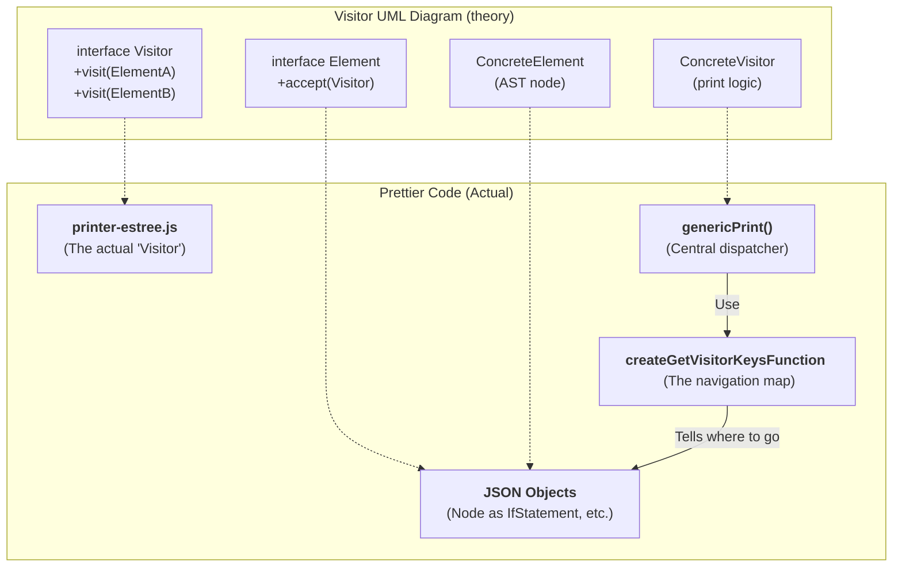
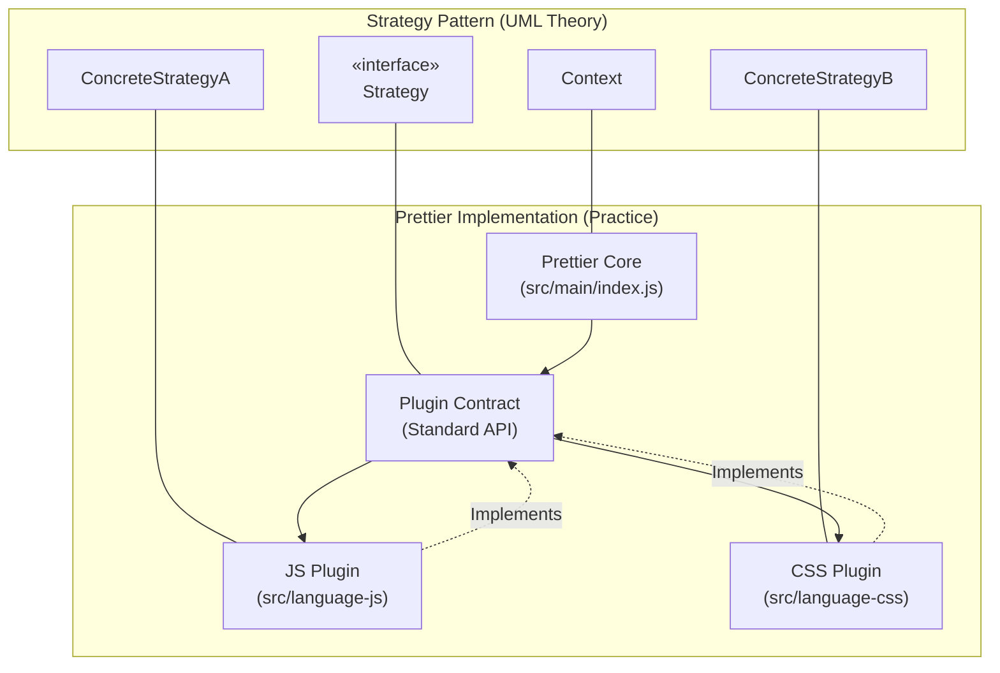

# Visitor Design Pattern (how to navigate AST)

## Less formal answers
- Which classes play which role? 
    - There are no classes involved but files. They are listed below in the diagram.
- Why is the pattern used? Which problem does solve?
	- This pattern is used to maintain outside the printing logic of every node of the AST tree without editing them. In this way it's possible to change the logic of the print. It allows to avoid the integration of the new feature into an existing node.
- Is there an alternative, what would be pros & cons?
	- The alternative could be to put the print logic inside a node of the AST but usually these structures are generated by external tool which uses default formats and it's better do avoid modifying them. It'd be a good choice in case of a little local developed node witi few attributes in order to use (`node.print()` or something like that). 

---

## 1. Which classes play which role?

This patterns is implemented in a functional way instead of rigid classes. The roles are:

- **The Visitor:** It's the **Printer** (es. `src/language-js/printer-estree.js`). His main function is `genericPrint`, which acts as the central dispatcher ("brain") who knows how to format every node type.
    
- **The Elements:** They're **the nodes of the AST** (Abstract Syntax Tree) generated by parsers. These objects represents the structure of the code (es. `IfStatement`, `BinaryExpression`).
    

- **The Navigator**: The `createGetVisitorKeysFunction` function (in `src/main/create-get-visitor-keys-function.js`) acts as the guide that instructs the Visitor on which node properties contain children to be visited, excluding non-traversable keys such as `parent` or `comments`.    

---

## 2. Why is the pattern used? Which problem does it solve?

Prettier uses the Visitor pattern to address the **Separation of Concerns** principle:

- **Decoupling:** It separates the printing algorithm from the AST data structure. This allows developers to change how a language is formatted without having to modify the parser that generates the tree.
    
- **Extensibility:** It makes it easier to add new languages. To support a language like Java, for example, you simply need to create a new Printer (a new Visitor) that knows how to navigate the nodes of the Java AST.
    
- **Complexity Management:** It manages the recursive nature of code. Since code is essentially a tree of trees (e.g., an `if` statement contains a `block`, which in turn contains a `variable`), the Visitor pattern is the most natural way to process deep hierarchical structures without writing monolithic code.
    

---

## 3. Is there an alternative, what would be pros & cons?

The main alternative would be to embed the printing logic directly inside the AST nodes (a procedural or classic object-oriented approach).

### Alternative: "Print" methods inside nodes

- **Pros:**
    
    - **More intuitive for small projects:** Each object knows how to print itself (e.g., `node.print()`).
        
    - **Less boilerplate:** No need for a central dispatcher or a "visitor keys" map.
        
- **Cons (Why Prettier does NOT use it):**
    
    - **Violation of the Open/Closed Principle:** If you wanted to change the formatting style, you would have to modify the classes of every single node.
        
    - **Data Pollution:** ASTs are often generated by external libraries (like Babel). You cannot (and should not) inject formatting methods into objects that are meant solely to represent data.
        
    - **Maintenance Difficulty:** The printing logic would be scattered across hundreds of different files instead of being centralized in a single Printer per language.

---

## Further Insights

- **From Interface to Printer:** In a standard UML diagram, the `Visitor` defines the visit methods. In Prettier, this role is handled by the printer files (such as `printer-estree.js`), which contain the logic for "visiting" different languages.
    
- **From ConcreteVisitor to Dispatcher:** Instead of having numerous methods like `visitElementA()` or `visitElementB()`, Prettier uses a central function called `genericPrint`. This function acts as a sorting office: it checks the node type and decides which part of the code should handle it.
    
- **From Element to JSON Node:** Standard diagrams show `Elements` as classes with an `accept()` method. In Prettier, nodes are simple data (JSON objects). They have no internal methods; it is the Prettier engine that "accepts" the visitor by passing the node to it.
    
- **The Role of `createGetVisitorKeysFunction`:** This is the "missing piece" compared to the classic diagram. Since JSON nodes don't know who their children are (they lack `accept` logic), this function provides the necessary map so that `genericPrint` knows which keys to traverse and when to stop.

- **In Summary:** While the UML diagram suggests that the object itself guides the visitor (`v.visit(this)`), in Prettier the logic is **inverted**: it is the Visitor that, by consulting the `VisitorKeys` map, actively decides which "doors" to enter.

# Strategy Pattern ( what to use for printing - plugins)

## **Which classes play which role?**
- **Context:** Il **Prettier Core**. È l'orchestratore che riceve il file originale e decide quale "strumento" usare. È la classe o il modulo principale che riceve il comando di formattazione. Non sa 'come' formattare un linguaggio specifico, sa solo che deve farlo.
- **Strategy Interface:** È il **Plugin Contract**.  È l'insieme di regole (API) che ogni plugin deve rispettare. Prettier si aspetta che ogni strategia esponga metodi standard come `parse` e `print`.
- **Concrete Strategy:** Sono i moduli (**Plugin specifici**) dedicati ai singoli linguaggi (*JavaScript, CSS, HTML*). Ognuno di essi implementa la propria logica interna per gestire le regole sintattiche del linguaggio specifico."

## **Why is the pattern used?**
"Il pattern viene scelto per risolvere il problema dell'**accoppiamento rigido** e della **scaldabilità**:
- **Disaccoppiamento:** Il motore di Prettier non ha bisogno di conoscere i dettagli del CSS o del Markdown. Questo rende il 'core' pulito e facile da mantenere.
- **Principio Open/Closed:** Possiamo aggiungere il supporto a nuovi linguaggi (Open) senza dover modificare il codice sorgente del motore principale (Closed). Basta creare una nuova 'strategia' e inserirla nel sistema.
- **Selezione a Runtime:** Prettier decide quale strategia usare solo nel momento in cui vede l'estensione del file, rendendo il sistema estremamente flessibile."

## **Alternative (Monolithic approach):**
"L'alternativa sarebbe un **approccio monolitico procedurale**, ovvero un unico, gigantesco file pieno di istruzioni condizionali (`if/else` o `switch`).
- **Pro dell'alternativa:** Potrebbe essere leggermente più veloce in termini di millisecondi perché evita il caricamento dinamico dei moduli.
- **Contro (Il motivo per cui Prettier la scarta):** Man mano che aggiungiamo linguaggi, il codice diventerebbe impossibile da gestire. Inoltre, non permetterebbe la creazione di plugin esterni da parte della community, poiché tutta la logica sarebbe 'cablata' dentro il programma principale, impedendo l'estensibilità che rende Prettier lo standard del settore."

