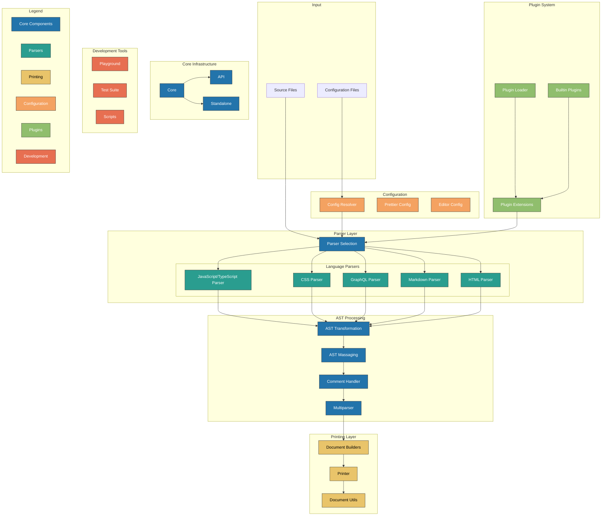

```mermaid


graph TB
    subgraph Input
        Files[Source Files]
        Config[Configuration Files]
    end

    subgraph Parser_Layer [Parser Layer]
        PS[Parser Selection]:::core
        
        subgraph Language_Parsers [Language Parsers]
            JP["JavaScript/TypeScript Parser"]:::parser
            CP["CSS Parser"]:::parser
            GP["GraphQL Parser"]:::parser
            MP["Markdown Parser"]:::parser
            HP["HTML Parser"]:::parser
        end
    end

    subgraph AST_Processing [AST Processing]
        AST["AST Transformation"]:::core
        MA["AST Massaging"]:::core
        CH["Comment Handler"]:::core
        MP2["Multiparser"]:::core
    end

    subgraph Printing_Layer [Printing Layer]
        DB["Document Builders"]:::print
        PR["Printer"]:::print
        DU["Document Utils"]:::print
    end

    subgraph Config_Layer [Configuration]
        CR["Config Resolver"]:::config
        PC["Prettier Config"]:::config
        EC["Editor Config"]:::config
    end

    subgraph Plugin_System [Plugin System]
        PL["Plugin Loader"]:::plugin
        BP["Builtin Plugins"]:::plugin
        PE["Plugin Extensions"]:::plugin
    end

    subgraph Core_Infra [Core Infrastructure]
        CI["Core"]:::core
        API["API"]:::core
        SA["Standalone"]:::core
    end

    subgraph Dev_Tools [Development Tools]
        PG["Playground"]:::dev
        TS["Test Suite"]:::dev
        SC["Scripts"]:::dev
    end

    %% Connessioni logiche
    Files --> PS
    Config --> CR
    CR --> PS
    
    PS --> JP & CP & GP & MP & HP
    JP & CP & GP & MP & HP --> AST
    AST --> MA
    MA --> CH
    CH --> MP2
    MP2 --> DB
    
    DB --> PR
    PR --> DU
    
    PL --> PE
    BP --> PE
    PE --> PS
    
    CI --> API
    CI --> SA
    
    %% Stili
    classDef core fill:#2374ab,color:#fff,stroke:#333
    classDef parser fill:#2a9d8f,color:#fff,stroke:#333
    classDef print fill:#e9c46a,color:#000,stroke:#333
    classDef config fill:#f4a261,color:#fff,stroke:#333
    classDef plugin fill:#90be6d,color:#fff,stroke:#333
    classDef dev fill:#e76f51,color:#fff,stroke:#333

    %% Legenda
    subgraph Legend
        C1["Core Components"]:::core
        P1["Parsers"]:::parser
        PR1["Printing"]:::print
        CF1["Configuration"]:::config
        PL1["Plugins"]:::plugin
        D1["Development"]:::dev
    end
```